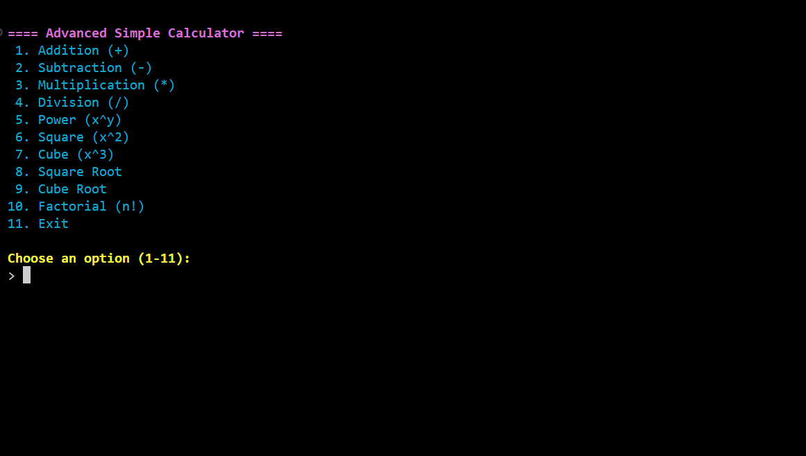

# 🧮 Advanced Simple Calculator (C++ Console Application)

A modern, terminal-based calculator application built in C++ with a colorful and user-friendly interface. It supports a wide range of mathematical operations and robust input validation for smooth user experience.

---

## 🚀 Demo

Here’s a quick preview of the calculator in action:

  

---

## ✨ Features

- ➕ Addition  
- ➖ Subtraction  
- ✖️ Multiplication  
- ➗ Division (with zero-division check)  
- 🔢 Power (x^y)  
- ² Square (x²)  
- ³ Cube (x³)  
- √ Square Root (non-negative input)  
- ∛ Cube Root  
- ! Factorial (non-negative integers)  

---

## 🎨 UI & UX Highlights

- 🌈 Colorful text output for clear distinction of inputs, results, and errors.  
- ⚠️ Smart input validation to prevent invalid or unexpected inputs.  
- 💻 Simple left-aligned interface for easy readability.  
- 🧹 Clears screen after every calculation to keep things tidy.  

---

## 🕹️ How to Use

1. **Run the program.**  
2. Choose the operation by entering the option number.  
3. Enter the required input(s) as prompted.  
4. View the result displayed in colorful output.  
5. Choose to perform another calculation or exit.  

---

## 🛠️ Tech Stack

| Technology     | Purpose                                  |
| -------------- | ---------------------------------------- |
| C++            | Core programming language                |
| `<iostream>`   | Input/Output operations                   |
| `<cmath>`      | Mathematical functions like pow, sqrt    |
| ANSI Escape Codes | Colorful terminal text output           |
| `<limits>`     | Input validation                         |

---

## 🖥️ Compilation & Running

# Compile the program using g++
g++ -o simple_calculator simple_calculator.cpp

# Run the executable
./simple_calculator     # Linux/macOS

simple_calculator.exe   # Windows

# 📜 Application Rules

-  Contact names must only contain alphabets and spaces.

- Phone numbers should be numeric only.

- Email validation is basic (must contain '@' and '.').

- All data is saved to contacts.dat file automatically on exit.

- When program starts, previously saved contacts are loaded automatically.

# 📫 Feedback
If you have any suggestions, feedback, or improvements:

📬 Email: sudhanshu95084145@gmail.com

